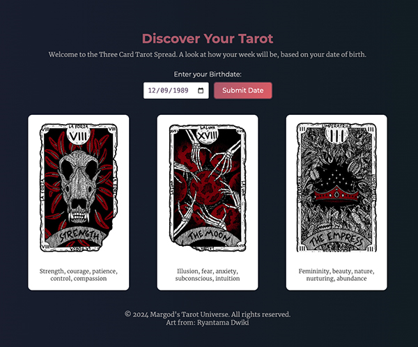

# Tarot Reading Web App

    

Welcome to the Tarot Reading Web App, a simple yet powerful tool designed to offer personalized tarot card readings based on users' birthdates. Utilizing a blend of traditional tarot interpretations and influences from astrological data, this app provides insightful spreads to guide users through their queries about past, present, and future.

## Features

- **Date of Birth Input**: Users can input their date of birth to get a tarot reading that is more aligned with their personal astrological and numerological chart.
- **Dynamic Tarot Spreads**: The app offers a three-card tarot spread, providing insights into different aspects of one's life.
- **Animated Background**: A dark, moving gradient background enhances the user interface, offering a visually appealing experience.
- **Responsive Design**: Crafted to provide a great experience across various devices and screen sizes.